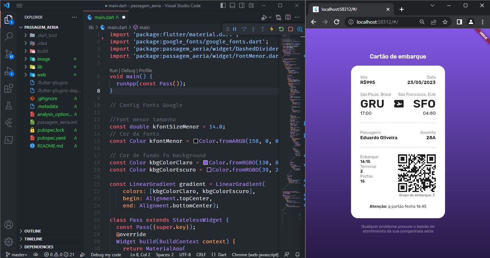

# Projeto Passaporte

Projeto estudo de widget

Desenvolvi um projeto em Flutter para criar uma tela de representação de um passaporte de aeroporto. O desafio foi proposto pela Rocketseat (#boracoda) para desenvolvedores com experiência em JavaScript e front-end, mas optei por usar Flutter. Está sendo um desafio, e aprendendo sobre as personalização dos widgets no flutter.

## Como contribuir
Se você estiver interessado em contribuir com o projeto, por favor siga as etapas abaixo:

## Dê um fork no repositório.
Crie um branch com o nome da sua nova funcionalidade ou correção.
1. Faça suas alterações e adicione documentação se necessário.
2. Teste suas alterações para garantir que elas não quebram outras partes do aplicativo.
3. Envie um pull request e aguarde revisão.
Licença
4. Este projeto está licenciado sob a licença MIT - veja o arquivo LICENSE.md para detalhes.

